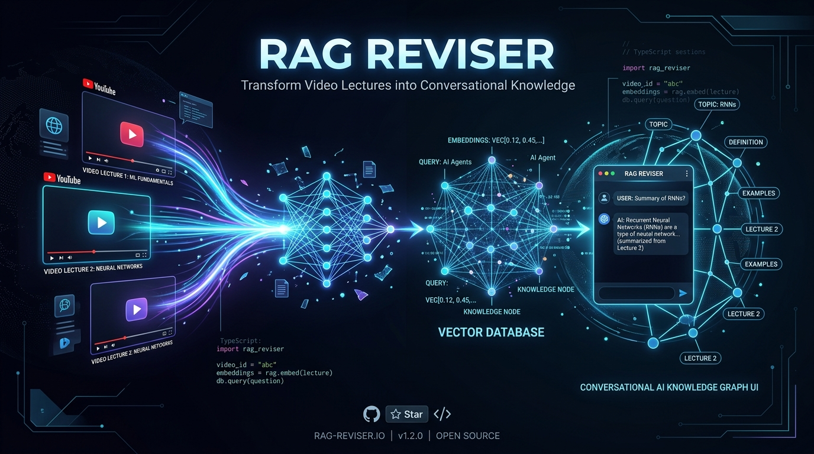
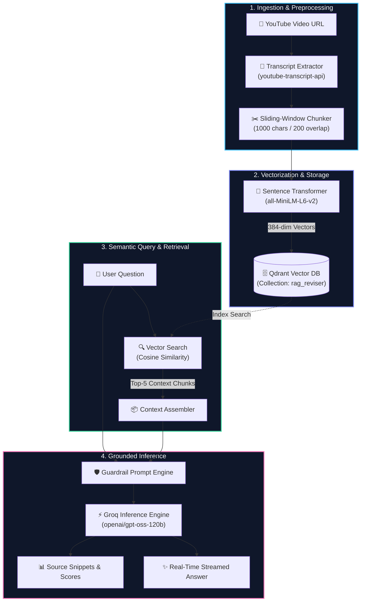

<div align="center">



# 🎓 RAG Reviser

### *Turn Long YouTube Lectures into Interactive, Grounded Knowledge*

[](https://www.python.org/)
[](https://qdrant.tech/)
[](https://groq.com/)
[](https://huggingface.co/sentence-transformers/all-MiniLM-L6-v2)
[](https://github.com/astral-sh/uv)
[](LICENSE)

<p align="center">
  <a href="#-overview">Overview</a> •
  <a href="#-key-features">Key Features</a> •
  <a href="#-architecture--pipeline">Architecture</a> •
  <a href="#-tech-stack">Tech Stack</a> •
  <a href="#-getting-started">Getting Started</a> •
  <a href="#-how-it-works">How It Works</a> •
  <a href="#-demo-preview">Demo Preview</a> •
  <a href="#-roadmap">Roadmap</a>
</p>

</div>

---

## 📌 Overview

**RAG Reviser** is an intelligent, retrieval-augmented assistant designed to solve a core problem in modern digital learning: **information retrieval from hours-long educational videos**.

Watching 1–3 hour lectures, research talks, or tutorials to find a specific definition, formula, or topic explanation is tedious. Generic LLMs hallucinate or provide generic answers disconnected from what the lecturer actually explained.

**RAG Reviser** extracts video transcripts across multiple languages, segments them using overlapping sliding-window chunking, indexes dense semantic representations inside **Qdrant Vector Database**, and streams low-latency, hallucination-resistant answers with exact source citations powered by **Groq High-Speed Inference (`openai/gpt-oss-120b`)**.

---

## ✨ Key Features

- 📹 **Universal YouTube Ingestion**: Supports standard YouTube watch URLs (`youtube.com/watch?v=...`), short links (`youtu.be/...`), and YouTube Shorts (`/shorts/...`).
- 🌐 **Multi-Language Subtitle Parsing**: Fetches auto-generated or manually uploaded transcripts across English (`en`, `en-US`), Hindi (`hi`), and Bengali (`bn`).
- 🧩 **Sliding-Window Semantic Chunking**: Employs dynamic 1,000-character chunks with a 200-character overlap to eliminate context loss across concept boundaries.
- 🧬 **Dense Vector Embeddings**: Uses HuggingFace's `all-MiniLM-L6-v2` transformer to generate 384-dimensional dense semantic vectors.
- ⚡ **Qdrant Vector Engine**: Automatic collection provisioning, cosine distance indexing, and persistent payload storage for sub-millisecond similarity search.
- 🚀 **Blazing-Fast LLM Token Streaming**: Leverages Groq LPUs (`openai/gpt-oss-120b`) for instantaneous, typewriter-style token streaming responses.
- 🛡️ **Anti-Hallucination Guardrails**: System instructions strictly ground answers to the retrieved lecture context with explicit warnings when knowledge is missing.
- 📑 **Transparent Source Attribution**: Returns top-$K$ source segments with cosine relevance scores and raw text snippets for complete verification.

---

## 🏗️ Architecture & Pipeline



---

## 💻 Demo Preview

Here is a preview of the CLI pipeline processing a lecture and answering questions in real-time:

```bash
$ python main.py

Fetching transcript...
Transcript fetched.

Creating chunks...
Created 42 chunks.

Creating embeddings...
Created 42 embeddings.
Embedding dimensions: 384

Checking Qdrant collection...
Collection 'rag_reviser' already exists.
Storing chunks in Qdrant...
Stored 42 chunks in Qdrant.

Ask your question: What is the gradient descent optimization algorithm?

Searching relevant lecture content...
Found 5 relevant chunks.

================ ANSWER ================

According to the lecture, Gradient Descent is an iterative optimization 
algorithm used to minimize the loss function by updating model weights 
in the opposite direction of the gradient. 

The update rule follows:
    w = w - (learning_rate * gradient)

The instructor emphasizes:
1. Learning rate tuning prevents overshooting the local minimum.
2. Batch gradient descent computes over all samples, while mini-batch 
   balances computational efficiency with convergence stability.

================ SOURCES ================

Source 1
Score: 0.8642
"...when we compute the gradient of the loss with respect to weights, we step 
in the negative gradient direction scaled by alpha, which is our learning rate..."

Source 2
Score: 0.8129
"...batch gradient descent vs mini-batch gradient descent. In practice, 
mini-batch allows vectorized hardware acceleration while preserving noisy gradients..."
```

---

## 🧰 Tech Stack

| Component | Technology | Rationale |
|---|---|---|
| **Language** | [Python 3.11+](https://www.python.org/) | Modern typing, rich ecosystem for NLP & Vector AI |
| **Package Manager** | [Astral uv](https://github.com/astral-sh/uv) | 10-100x faster dependency resolution and virtual environments |
| **Transcript Ingestion** | [`youtube-transcript-api`](https://pypi.org/project/youtube-transcript-api/) | Extracts timestamped subtitles without requiring video downloads |
| **Embedding Model** | [`all-MiniLM-L6-v2`](https://huggingface.co/sentence-transformers/all-MiniLM-L6-v2) | 384-dimensional dense vectors with high benchmark accuracy and low latency |
| **Vector Database** | [Qdrant Cloud / Local](https://qdrant.tech/) | High-throughput HNSW index, cosine distance, payload filtering |
| **LLM Inference** | [Groq Cloud](https://groq.com/) | Blazing-fast inference speeds with streaming responses |
| **Foundation Model** | `openai/gpt-oss-120b` | High reasoning capability, instruction adherence, zero hallucination |

---

## 📂 Project Structure

```text
RAG-reviser/
├── assets/
│   └── banner.jpg              # Project visual banner for GitHub
├── backend/
│   ├── app/
│   │   ├── __init__.py
│   │   ├── youtube.py          # YouTube video ID parsing & transcript fetcher
│   │   ├── chunking.py         # Overlapping sliding-window chunker
│   │   ├── embeding.py         # SentenceTransformer embedding generation
│   │   ├── vector_store.py     # Qdrant collection creation & chunk upsertion
│   │   ├── retrival.py         # Semantic similarity query execution
│   │   └── llm.py              # Groq streaming completion & prompt guardrails
│   ├── main.py                 # Pipeline orchestrator & interactive CLI
│   ├── pyproject.toml          # Project metadata & dependencies
│   ├── uv.lock                 # Deterministic dependency lockfile
│   ├── .env.example            # Environment variable template
│   └── .gitignore              # Git ignore rules for Python & venv
├── .env.example                # Root environment template
└── README.md                   # Repository documentation
```

---

## 🚀 Getting Started

### Prerequisites

Ensure you have the following installed:
- **Python 3.11+** or [Astral uv](https://docs.astral.sh/uv/)
- A free [Groq Cloud Account](https://console.groq.com/) to obtain an API key
- A free [Qdrant Cloud Account](https://cloud.qdrant.io/) (or a local Docker instance)

---

### 1. Clone the Repository

```bash
git clone https://github.com/Sibasish2005/RAG-reviser.git
cd RAG-reviser/backend
```

### 2. Environment Configuration

Copy the example environment file:

```bash
cp .env.example .env
```

Open `.env` and fill in your credentials:

```env
# Groq Cloud API Key (https://console.groq.com/keys)
GROQ_API_KEY=gsk_your_groq_api_key_here

# Qdrant Vector Database (Cloud cluster or http://localhost:6333)
QDRANT_URL=https://your-cluster-id.us-east-1.qdrant.tech:6333
QDRANT_API_KEY=your_qdrant_api_key_here
```

### 3. Install Dependencies

Using **uv** (recommended for speed):
```bash
uv sync
```

Or using standard **pip**:
```bash
python -m venv .venv
source .venv/bin/activate   # On Windows: .venv\Scripts\activate
pip install -r pyproject.toml
```

### 4. Run the Pipeline

```bash
python main.py
```

Provide any YouTube video URL inside `main.py` or interactively, and ask questions!

---

## 🔬 How It Works (Deep Dive)

### 1. Ingestion & URL Normalization
The ingestion module handles multiple URL schemes:
- Standard: `https://www.youtube.com/watch?v=VIDEO_ID`
- Shortened: `https://youtu.be/VIDEO_ID`
- Shorts: `https://www.youtube.com/shorts/VIDEO_ID`

Subtitles are fetched across prioritize language codes: `en-US`, `en`, `hi`, and `bn`.

### 2. Overlapping Chunking Strategy
Naïve paragraph or sentence splitting frequently cuts explanations in half. We implement an overlapping window:
$$\text{Window Size} = 1000 \text{ characters}, \quad \text{Stride} = 800 \text{ characters} \quad (\text{Overlap} = 200 \text{ characters})$$
This guarantees that technical phrases and connecting thoughts are preserved in adjoining chunks.

### 3. Vector Representation
Text chunks are embedded using `all-MiniLM-L6-v2`:
$$\vec{v} = \text{Embed}(c) \in \mathbb{R}^{384}$$
The vectors are indexed in Qdrant with Cosine distance metric:
$$\text{Similarity}(\vec{u}, \vec{v}) = \frac{\vec{u} \cdot \vec{v}}{\|\vec{u}\| \|\vec{v}\|}$$

### 4. Grounded Prompt Engineering
The retrieved chunks form the explicit context window for the model:
```text
You are an AI revision assistant.
Answer the user's question using the provided lecture context.
Rules:
- Use the lecture context as your primary source.
- Do not invent information that is not present in the context.
- Explain the answer clearly and accurately.
- If the context does not contain enough information, say so.
```

---

## 🗺️ Roadmap

- [x] Ingestion for YouTube transcripts (multi-language: en, hi, bn)
- [x] Overlapping sliding-window chunking
- [x] Dense embedding vectorization (`all-MiniLM-L6-v2`)
- [x] Qdrant Cloud vector indexing with payload preservation
- [x] Groq token streaming inference (`openai/gpt-oss-120b`)
- [ ] **FastAPI REST API**: Endpoints for indexing, status checking, and SSE streaming
- [ ] **Interactive Frontend**: Modern Next.js / Tailwind UI with video player synchronization
- [ ] **Direct Timestamp Navigation**: Clicking a citation jumps directly to that timestamp in the video
- [ ] **Multi-Video Knowledge Base**: Index entire playlists or full course syllabi
- [ ] **PDF & Slide Fusion**: Combine lecture slides with spoken audio transcripts

---

## 🤝 Contributing

Contributions, issues, and feature requests are welcome!

1. Fork the project
2. Create your Feature Branch (`git checkout -b feature/AmazingFeature`)
3. Commit your Changes (`git commit -m 'feat: add some AmazingFeature'`)
4. Push to the Branch (`git push origin feature/AmazingFeature`)
5. Open a Pull Request

---

## 📄 License

This project is open-source and licensed under the [MIT License](LICENSE).

<div align="center">

Made with ❤️ by [Sibasish](https://github.com/Sibasish2005)

⭐ *If you found this project helpful, please give it a star on GitHub!* ⭐

</div>
